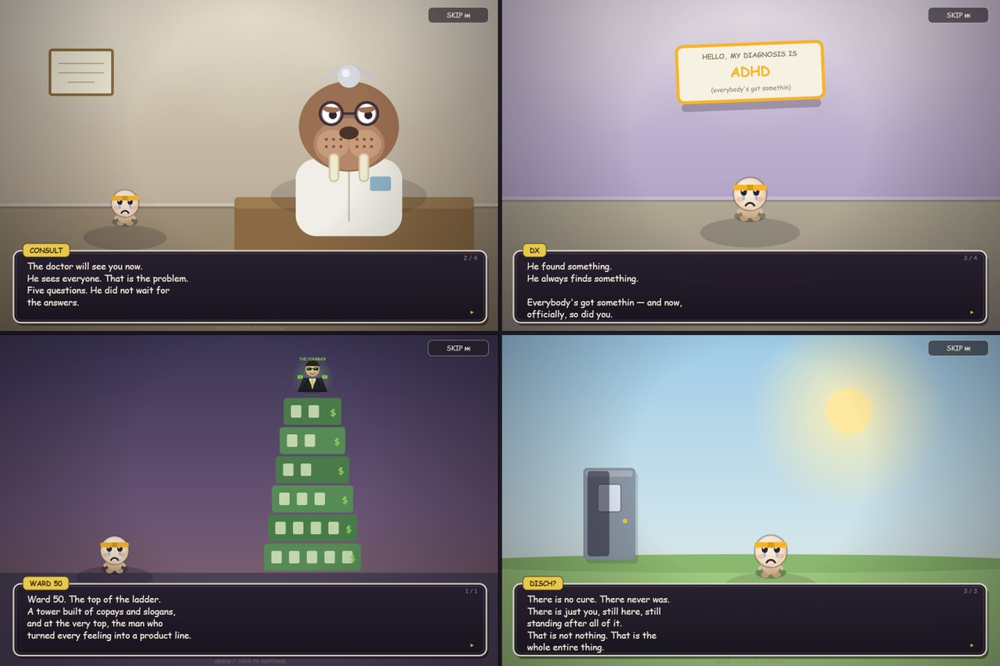
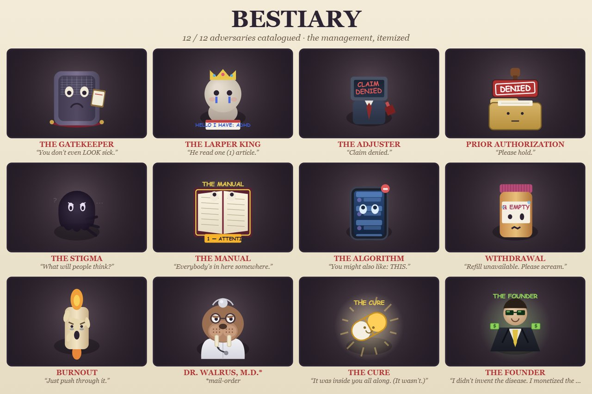

# Everybodies Got Somethin 🦭

**A satirical Binding-of-Isaac-style roguelike about getting diagnosed with Everything™.**

  
  &nbsp;
  

Dr. Walrus — board-certified in Confidence — gives you a five-question checkup and hands you a label:
**ADHD, Bipolar Disorder, Chronic Depression, Generalized Anxiety, Schizophrenia, OCD, PTSD,
Chronic Insomnia**… or, if you insist nothing is wrong, **Denial (severe)**. Master all nine and
**The Undiagnosed** opens — a fresh opinion every floor. Every diagnosis is a full Isaac-style
character with its own stats, mechanics, signature **PRN ability**, an unlockable **Second
Opinion** variant that flips its rules, and a **Midnight Ward** mastery skin. Then you pick your
**insurance plan** (Bronze, Silver, or Gold — the premium is your body) and descend into the
infinite wards, fighting Doomscrollers, Pharma Ads, Deadlines, and a sea of Larpers, armed with
your tears, whatever the pharmacy hands you, and — if you've earned one — an **Emotional Support
Animal** with strong opinions about crumbs.

> A satire about a system that hands out labels like candy — not about the people living with them.

## Play

**In your browser, PC or mobile:** open `index.html` (or the GitHub Pages link for this repo).

Take the checkup and let Dr. Walrus label you — or open **📁 Patient Files**, the Isaac-style
character select where every diagnosis is its own playable character with unique stats, mechanics,
and a starting prescription. (One of them is locked. Try telling the truth.)

| | PC | Mobile | Gamepad |
|---|---|---|---|
| Move | `WASD` | left thumb | left stick |
| Shoot | Arrow keys or mouse | right thumb | right stick |
| Ability | `Space` | ⚡ button | `A` / bumpers |
| Pill | `Q` | 💊 button | `X` |
| Claim Form (bomb) | `E` | 📄 button | `B` |
| Pause | `P` / `Esc` | II button | `Start` |
| **Patient Two joins** | — | — | `Select` |

**Couch co-op:** press `Select` on a controller mid-run and a second patient checks in — their own
diagnosis, their own little hearts, revived when the room clears. The pad is theirs; P1 keeps
keyboard and mouse.

## The rules of the ward

- **Clear rooms** to open the doors. **Referrals** 🔑 unlock the Specialist's office (free item).
- **Copays** ¢ buy refills at the Pharmacy — Brand® or Generic (cheaper, side effects), with GoodRx
  coupons and a restock shelf. Copays climb with the ward. It's the healthcare system, baby.
- **Pills** are unidentified until you swallow one. Take four on one floor and you're **overprescribed**.
- Beat the boss, take the trapdoor, choose your **treatment plan** (inpatient / outpatient / day
  program), pick up a **comorbidity**, go deeper. Forever. **Dr. Walrus is waiting on every 5th
  ward**, and he keeps upping the dose.
- The wards fight back: side-effect curses, ward complications, and **special rooms** everywhere —
  the sanctuary **Day Room** (water cooler, fellow patients, a recruit), the **Seclusion** altar
  (bleed for loot), the **ECT Suite** (a prize under the discharge), the **Padded Cell** (every
  bullet ricochets), and **Observation** (dodge the surveillance sweep to earn discharge).
- **The Support Group:** recruit up to three fellow patients as AI allies who fight alongside you
  the whole run — heavy covering fire, anxious scatter, manic bursts, homing suspicion. The **Day
  Room** patients also offer **contracts** (side jobs with real payouts), and from Ward 8 its exit
  door lets you leave **Against Medical Advice** — sign the form, survive the ward's objection,
  earn the fourth ending. Die trying and the bill doubles.
- The ward has moods: **Shadow Wards** (mirrored, dark, double loot), **CODE GRAY** crises,
  champion bosses, THE AUDITOR roaming with your file, a **Drug Rep** bearing free samples (each
  with a string attached), a weary **Janitor** selling found items — five purchases earns you the
  basement — whatever killed you last run coming back with a grudge (**IT REMEMBERS YOU**), and,
  at depth 13, **THE THIRTEENTH WARD**: curated, candlelit, and holding the Master Key.
- **The Intercom** watches everything and comments — hoard coins, skip your pills, dodge too well,
  and Dr. Walrus will mention it over the PA.
- Bosses are the real stuff: The Gatekeeper ("you don't LOOK sick"), The Adjuster ("claim denied"),
  Prior Authorization, The Manual (DSM), The Algorithm, The Larper King, The Influencer,
  **THE PEER REVIEW** (it steals your build and fights you with it), Withdrawal, The Stigma,
  Burnout — with **THE CURE** waiting at Ward 25, **THE BOARD** at the top of the Ascent,
  **THE FOUNDER** at Ward 50, and **THE SYSTEM** itself at Ward 100. When you die, an **appeal**
  can overturn it — once — and the death screen reconstructs your last six seconds, killer circled.

## Between runs

- **🚪 The Waiting Room** — a walkable hub: every mode is a door, the fund jar fills with your
  "donated" change, and the furniture you buy with it (aquarium, coffee machine, toy corner) gives
  real perks. File a grievance at the **📋 Complaint Department** — next run it shows up wearing a
  name tag, and killing it pays.
- **🧠 Treatment Plan** — a permanent skill tree. Every run earns **◆ Insight**; spend it across
  five therapy modalities (CBT, DBT, EMDR, Meds Management, Group Work) for permanent perks.
- **🎲 Prognosis** & **🧪 Protocols** — challenge runs and rule-set gauntlets, from Glass Cannon
  to the 20-minute time slot.
- **⏰ OVERTIME** — arena mode: one room, escalating waves, management personally attends every
  tenth. The bill runs live on screen.
- **🗓️ Daily Ward** — a date-seeded run everyone shares (streaks + a month calendar), a weekly
  **Quarterly Review**, shareable seed-code challenges, **📦 Care Packages** (gift a friend an
  item + a note, no servers, just a code), and a **Diagnosis Card** you can post.
- **📋 Patient Chart** — a codex of every patient, boss, med, and pill you've met; completing a
  tab pays out a permanent perk. **📊 Run History** keeps your real win-rate receipts, and a
  **speedrun timer with splits** is one Settings toggle away.
- **🕹 The Breakroom Cabinet** — a real playable arcade machine in the hub: **PILL CATCHER**,
  45 seconds of catching scripts in a kidney dish while dodging RECALLS. 2¢ a play from the Fund,
  persistent high score, Insight milestones — and your rival's score is taped to the screen.
- **🏥 Joint Commission** — past Ward 15, some boss rooms hold **two managers at once**
  ("consolidated care"): one opens while the other reviews your file, kill one and the survivor
  gets furious, clear both for a double payout.
- **⚗ The Compounding Pharmacist** — a back room behind some pharmacies (and the basement):
  two meds enter, one mystery med from the good shelf leaves. FDA status: don't ask.
- **🚧 The Incident Site** — where you died last run gets roped off at that exact ward: your
  chalk outline, caution tape, numbered evidence tents, a flickering light, and a champion of
  whatever killed you dozing on guard over one bagged item from your old build. Reclaim it.
- **🏁 THE RIVAL** — someone checked in the same day as you, and the building keeps score. They
  burst into item rooms to race you to the pedestal, steal your prescription if they win, gloat
  over the intercom, and book the gym for a proper 1v1 — your mirror, with a grudge. Career
  records tracked forever.
- **🎁 The Gift Shop** — a hub cart that spends the Wellness Fund on your next check-in: flowers
  (+1 heart), a GET WELL balloon that follows you (+luck, pops after 3 hits), get-well cards
  (+damage, preprinted sentiment), a plush walrus, contraband chocolate, and a Visitor Pass that
  brings an armed guest.
- **🌙 The Night Shift** — the building keeps hours. Play 9pm–6am local and wards run dark:
  short-staffed but overcrowded, night differential pay on every room, whispered intercom
  announcements, and clinics staffed by the exclusive **NIGHT NURSE** ("lights out. it's policy.").
- **🎱 Ward Bingo** — a daily-seeded 5×5 card of small feats shared by every player, tracked
  automatically all day (dailies included). Lines pay ◆6, BLACKOUT pays ◆40 + 25¢ to the Fund.
- **📋 Custom Care Plans** — stack the house rules yourself (blackouts, fire drills, rate hikes…),
  name the protocol, dial the intensity, and export it as an `EGSCARE` code to dare a friend.
  Insight pays +8% per stacked rule; the building respects ambition.
- **📔 The Patient Diary** — every run writes itself into the journal on the hub coffee table:
  who you spared, what unionized, which intern graduated, what finally got you. Twenty pages,
  brutally honest, re-readable.
- **🗂 Misfiled Documents** — twelve pages of the building's true history (the 1974 intake form,
  the blueprint with an unnumbered floor, the fog-machine invoice) surface rarely where the mess
  was. Collected in the **ARCHIVE** tab of the Patient Chart.
- **🤝 The Reunion** — once your file is closed, the people from your journey drop by the Waiting
  Room: spared bosses take the visitor chairs, the Graduate works reception, and at night the
  janitor finally sits down.
- **💾 Your save keeps itself** — automatically, on-device, mirrored twice. Back it up or move it
  between devices with a save code from **Settings → SAVE DATA**.
- **🔧 STAFF ONLY** — a Game Tester door on the title screen, behind a secret code. Inside: a
  sandbox mode (any patient, any ward, nothing recorded — the save is snapshot-frozen), a full
  **Room Designer** (paint tiles, place any enemy or boss, playtest live, share rooms as
  `EGSROOM` codes), god mode, debug keys, an FPS overlay, and a cheat drawer on the pause menu.

## The story

Between the fighting, the game pulls back into hand-drawn **Chart Notes** — ink-and-wash cutscenes
told as pages in your patient file. Someone walked in for something small and got swept into the
machine; the whole story is finding the way back out.

It unfolds as you descend — a prologue, interludes at the milestone wards, and the truth waiting at
the bottom — and every chapter is re-readable from **📖 Chart Notes** on the title screen.
**[▶ Play now.](https://chasegannon42-maker.github.io/everybodies-got-somethin/)**

## The Bestiary

Sixteen bosses stand between you and the "cure," each one a different failure of the system —
gatekeeping, self-diagnosis culture, insurance denial, the pill mountain, shame, over-labeling,
the attention economy, wellness grifting… up through the fake finale and the tycoon at the very
top of the ladder.

Browse the full, **live-animated** gallery in-game — **☠ BESTIARY** on the title screen — where each
adversary reveals itself as you meet it. **[▶ Play now.](https://chasegannon42-maker.github.io/everybodies-got-somethin/)**

## Tech

Plain HTML5 canvas + vanilla JS. No frameworks, no build step, no assets — all art is procedural
and all audio is synthesized in WebAudio. Works offline once loaded.

Made with Claude Code.
